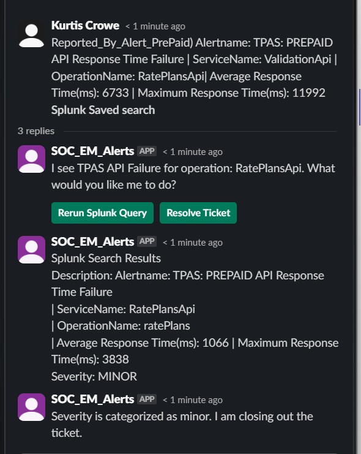

# Slack Bot for Splunk alert automation

This repository contains a Slack bot that was created to monitor application response time errors. It seamlessly integrates with Splunk, enabling streamlined querying and analysis of pertinent data. Moreover, it facilitates the closure and updating of ticket worklogs via API. Developed collaboratively by a colleague and myself, this bot serves as an automated solution for expediting the triage process during instances of application response time failures. By swiftly identifying issues and coordinating actions, it mitigates downtime and accelerates response times from supporting teams

## Description

the Slack to Splunk integrated bot is an automated solution to track and respond to response time errors. The bot is integrated with Slack and Splunk, enabling real-time alerts and the ability to execute predefined Splunk queries directly from Slack. This bot aims to streamline the incident management process, reduce response times, and provide actionable insights for system administrators and developers.

## Objectives

- **Automate Monitoring**: Continuously monitor TPAS Prepaid API response times and alert relevant stakeholders in Slack.
- **Real-Time Alerts**: Provide instant notifications in Slack when an API response time failure is detected.
- **Interactive Querying**: Allow users to rerun Splunk queries or resolve tickets directly from Slack messages.
- **Seamless Integration**: Integrate with Splunk to fetch, execute, and display query results without manual intervention.
- **Improved Response Time**: Reduce the time taken to identify and resolve API performance issues.

## Flow Diagram

## Test Cases

